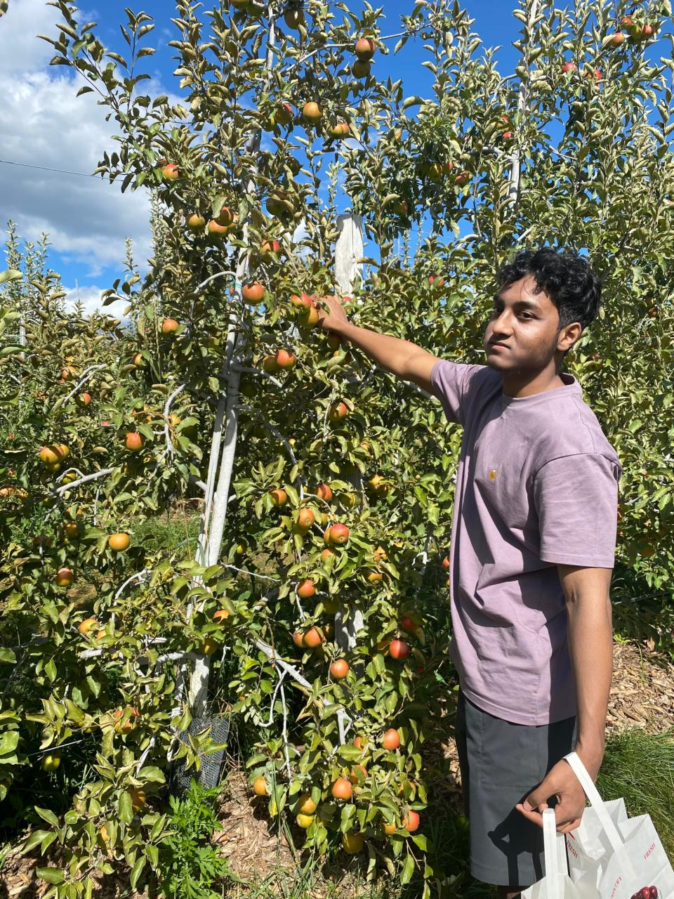

<h1 align="center">👋 Hi, I'm Ishmam</h1>
<h3 align="center">Software Engineer in New York City</h3>

Hi, I study Computer Science at City College of New York.  
I enjoy hackathons, fitness related activities like Mixed Martial Arts and soccer, reading & writing blogs.  
Background consists of in Full stack web development and data science/AI/ML.  
What drives me most is being able to use cool technologies to create impact.  
Would love to connect and meet new people, feel free to reach out!  

### Languages and Frameworks
<table>
  <tr>
    <td>Programming Languages</td>
    <td>
      
      
      
    </td>
  </tr>
  <tr>
    <td>Frontend</td>
    <td>
      
      
        
      
      
    </td>
  </tr>
  <tr>
    <td>Backend</td>
    <td>
      
      
      
    </td>
  </tr>
  <tr>
    <td>Databases</td>
    <td>
      
      
      
    </td>
  </tr>
  <tr>
    <td>AI/ML</td>
    <td>
      
      
        
      
      
     </td>
  </tr>
</table>

### 🌐 Socials:
  

<!---->

<!--
**IshmamF/IshmamF** is a ✨ _special_ ✨ repository because its `README.md` (this file) appears on your GitHub profile.

Here are some ideas to get you started:

- 🔭 I’m currently working on ...
- 🌱 I’m currently learning ...
- 👯 I’m looking to collaborate on ...
- 🤔 I’m looking for help with ...
- 💬 Ask me about ...
- 📫 How to reach me: ...
- 😄 Pronouns: ...
- ⚡ Fun fact: ...
-->
